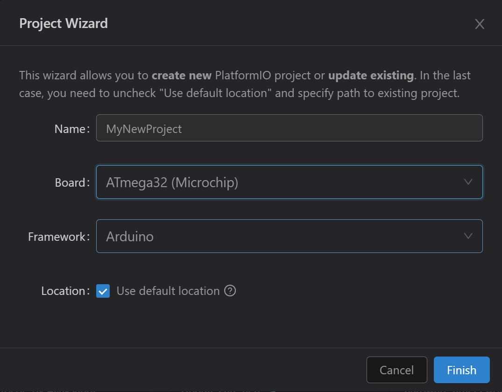

# PlatformIO + AVRDUDE
Diese Anleitung zeigt Ihnen wie sie PlatformIO (im folgenden PIO) im Micocontroller Labor nutzen können.
> __Achtung:__ Debugging ist leider nicht möglich!

## Installation
Wählen Sie in VS Code das Extensions Menü und suchen Sie Platformio. Installieren Sie diese Erweiterung in VS Code.

Bearbeiten sie die PATH Variable und fügen Sie folgenden Pfad hinzu (Verwenden Sie ihren Benutzernamen für 'UserName'):
> C:\Users\UserName\.platformio\penv\Scripts\

Weitere Informationen finden sie hier:
https://docs.platformio.org/en/latest/core/installation/shell-commands.html#piocore-install-shell-commands

## Projekt erstellen und konfigurieren
Wählen Sie das PIO Menü in VS Code neues projekt. In `PIO Home` klicken Sie auf den Button `neues Projekt`. Es öffnet sich ein project wizard. Wählen sie `ATmega32 (Micochip)` aus.Das Framework Arduino kann nicht abgewählt werden; Wir werden es später entfernen.



Mit Klick auf `Finish` wird eine Projektstruktur angelegt. Diese können Sie im VS Datei Explorer sehen. Öffnen Sie die Datei `platformio.ini`.

Fügen sie die folgende Konfiguration ein. Dabei wird der Eintrag `framework=arduino` entfernt.
 
 ```ini
[env:ATmega32]
platform = atmelavr
;this installs avrdude automatically
platform_packages = platformio/tool-avrdude@^1.70200.0
board = ATmega32

board_build.f_cpu = 8000000UL
upload_protocol = custom
upload_flags =
    -C
    ${platformio.packages_dir}/tool-avrdude/avrdude.conf
    -p
    m32
    -c
    jtag3
upload_command = avrdude $UPLOAD_FLAGS -U flash:w:$SOURCE:i
```

Benennen Sie die Datei `main.cpp` im Ordner `scr` in `main.c` um. Öffnen Sie diese Datei und ersetzen Sie den Inhalt mit dem folgenden Beispiel-Code:

```C
#define F_CPU 8000000UL
#include <avr/io.h>
#include <util/delay.h>

int main()
{
  DDRA = 0xFF;

  while(1)
  {
    PORTA ^= 0xFF;
    _delay_ms(200);
  }
}
```

## Projekt bauen und auf den Mikrocontroller laden
Öffnen sie links wieder das Menü von PlatformIO. In einer Detailansicht sollte ein Baum `PROJECT TASKS` erscheinen. Klicken sie in diesem auf `Build`. Verfolgen Sie den Build-Prozess im Terminal. 
Mit Klick auf den Menüeintrag `Upload` wird der gebaute Source Code auf den Mikrocontroller geladen.
